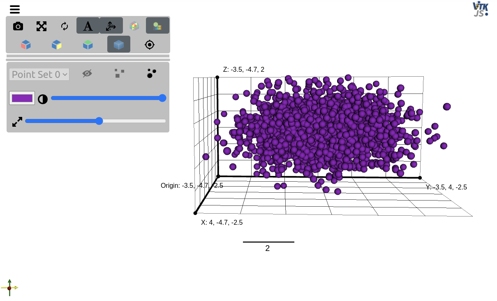
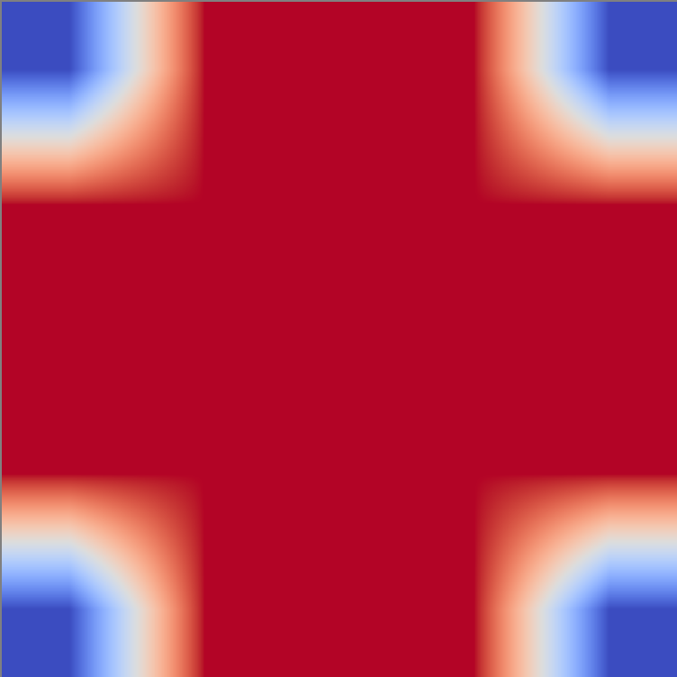
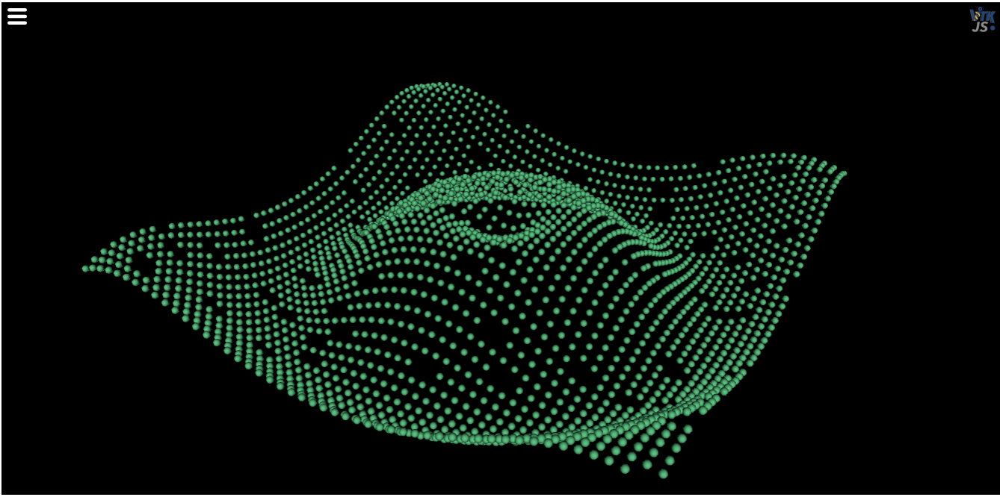
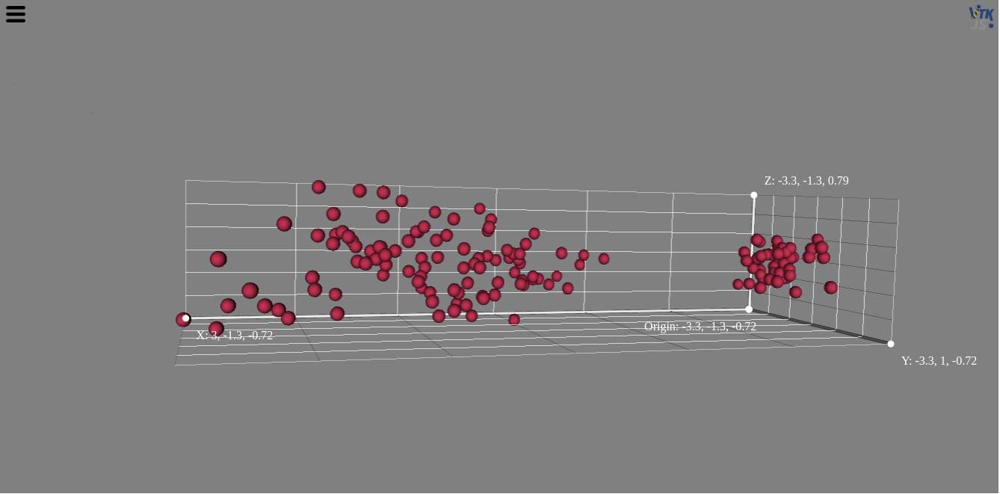
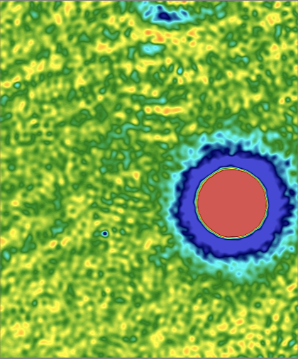
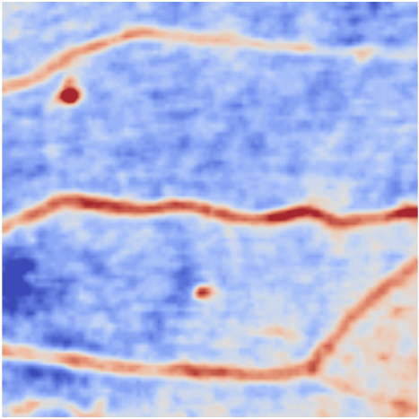
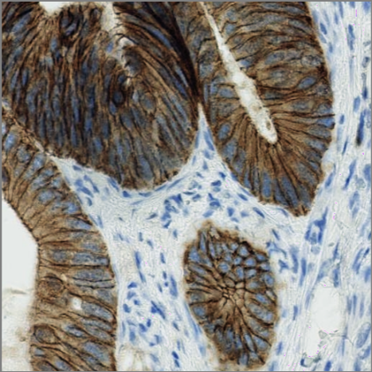
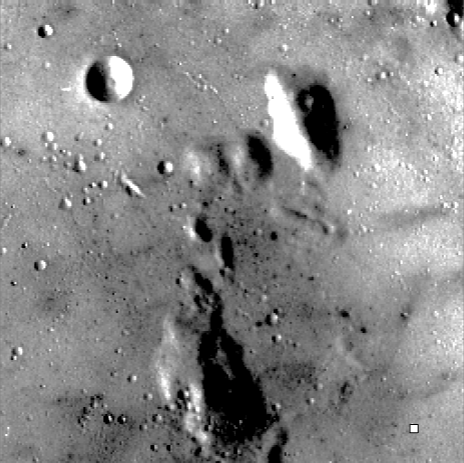

# Examples

The intent of these examples is to show how the visualization itkwidgets visualization tools can provide you with insights into image processing, statistical analysis. 
You can follow along with the instructions given below in the App tab.
All sections below use the Python Scientific Computing stack. 
 
To get started, you can call `piplite.install(<package-name>)`, which downloads and installs packages from [Pypi](https://pypi.org/).
Note: You have to wait for a little while to get the packages installed before proceding to the next cell on your notebook. 


<a href="../../_static/lab/index.html">
Try running the examples below interactively using JupyterLite!


</a>

For more information on how Jupyter lite works, please visit [JupyterLite documentation website](https://jupyterlite.readthedocs.io/en/latest/).


## Gaussian distribution with NumPy
NumPy is a Python library for multidimensional array containers with vector operations.    

```
import numpy as np
from itkwidgets import view

number_of_points = 3000
gaussian_mean = [0.0, 0.0, 0.0]
gaussian_cov = [[1.0, 0.0, 0.0], [0.0, 2.0, 0.0], [0.0, 0.0, 0.5]]
point_set = np.random.multivariate_normal(gaussian_mean, gaussian_cov, number_of_points)

view(point_sets=point_set)
```
It is important to indicate the input file is `point_sets`, so itkwidgets recognizes it as a point cloud rather than an image. 



## Binary Closing with SciPy
SciPy is a Python library that offers computational routines for technical and scientific computing. It offers modules for linear algebra, integration, interpolation, ODE solvers, optimization, etc.

In this example, we explore the `ndimage.binary_closing` which performs closing, a mathematical morphology operation. It shows that closing can close small holes and that closing is the erosion of the dilation of the input.  

|    Input   |   Output 1   |   Output 2   |
| ---------- | ------------ | ------------ |
||||


See the original example [here](https://docs.scipy.org/doc/scipy/reference/generated/scipy.ndimage.binary_closing.html).

## Estimating Missing Data with Pandas and NumPy
Pandas is a Python library that offers data structures and operations for manipulating data types and data series. 

|    Input   |   Output    |
| ---------- | ----------- |
|||


## PCA with Scikit-Learn



See the original example [here](https://scikit-learn.org/stable/auto_examples/decomposition/plot_pca_iris.html)

## Visualizing Scientific Images with SciKit-Image

:::{figure-md} shepp_logan_phantom
:class: myclass


Shepp–Logan phantom
:::

:::{figure-md} cell
:class: myclass



Cell
:::


:::{figure-md} microaneurysms
:class: myclass



Microaneurysms
:::

:::{figure-md} immunohistochemistry
:class: myclass



Immunohistochemistry
:::

:::{figure-md} moon
:class: myclass



Moon
:::
