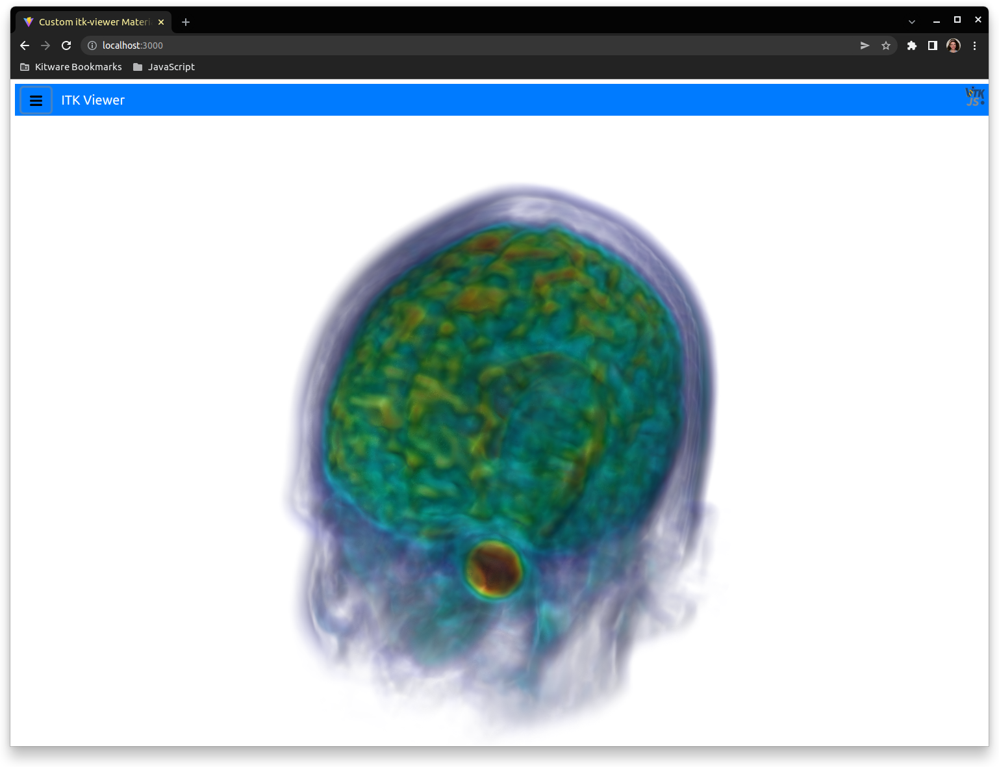

# User Guide

## Using the Web App

By default, the web app loads the files `http://localhost:8082/test-data/HeadMRVolume.nrrd` and `http://localhost:8082/test-data/HeadMRVolumeLabels.nrrd`. To visualize a different image, mesh, or point set file in your local system you can set the `image` and `labelImage` arguments in `index.html` to the desired URL.   

Besides that, you can introduce an extra argument to the `itkVtkViewer.createViewer` function to indicate your data set is bidimensional:
```
      itkVtkViewer.createViewer(container, {
        image: ipfsImage,
        rotate: false,
        config: { uiMachineOptions }
	use2D: true
      })
```


