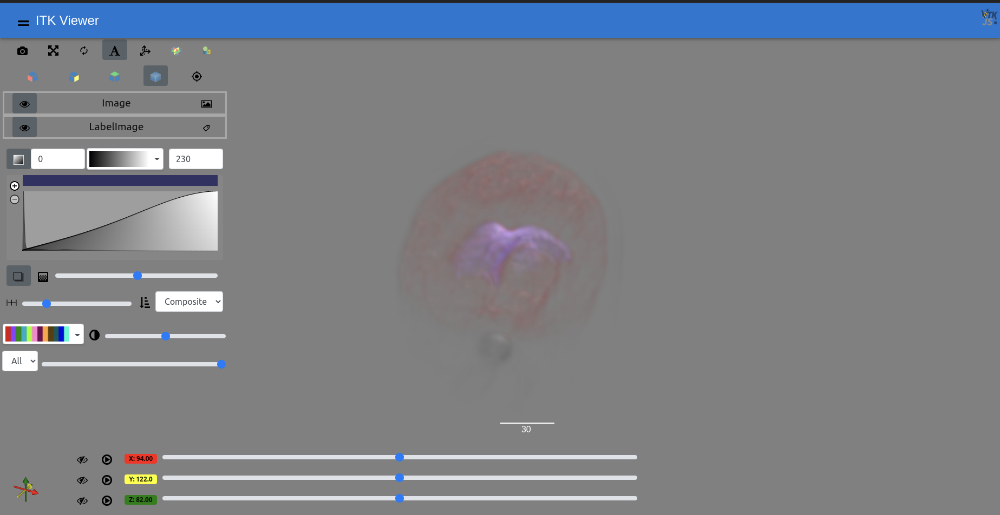

%.. itk-viewer-bootstrap-ui documentation master file, created by
%   sphinx-quickstart on Wed Jun 29 11:40:53 2022.
%   You can adapt this file completely to your liking, but it should at least
%   contain the root `toctree` directive.

# Welcome to itk-viewer-bootstrap-ui's documentation!

This is a React-Bootstrap interface for ITK/VTK Viewer. 


## Contents:
```{toctree}
./Develop/develop.md
./Contribute/contribute.md
```
